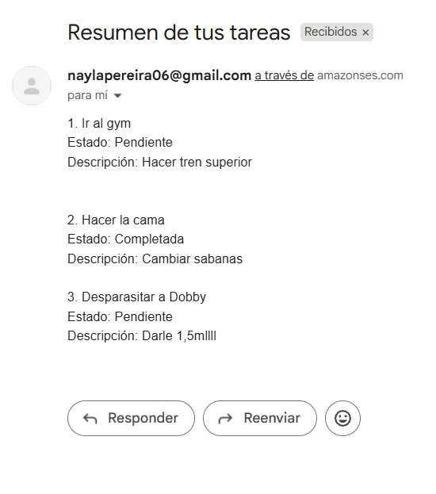
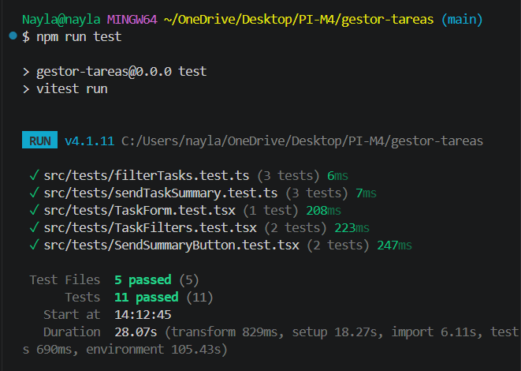
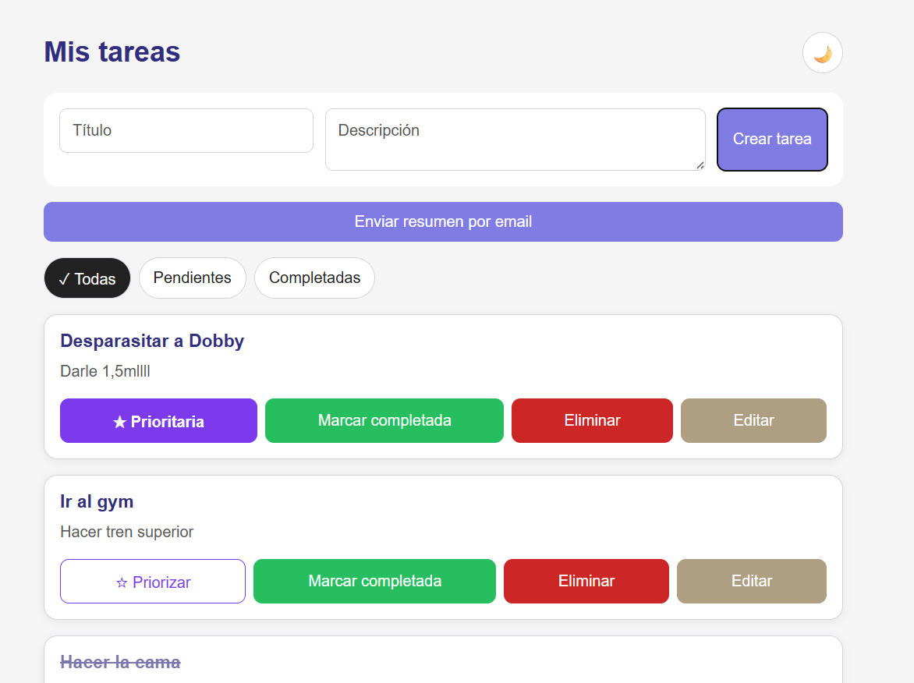
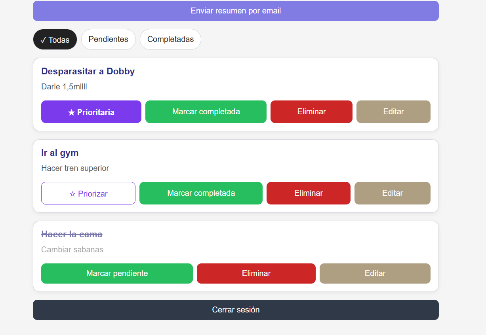
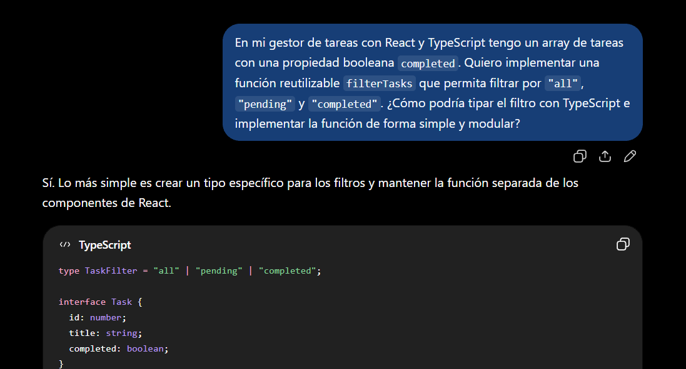
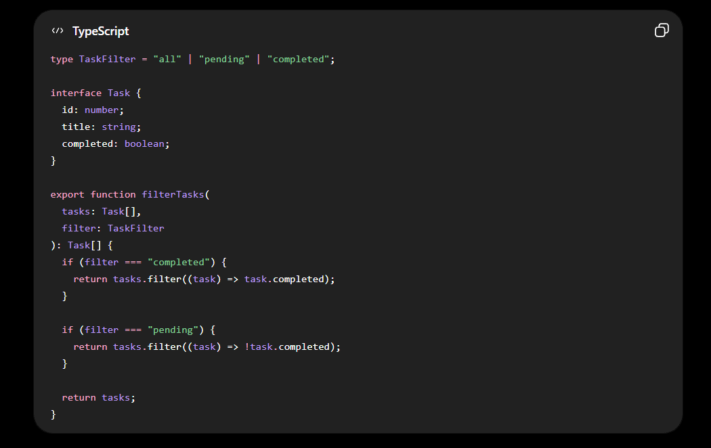
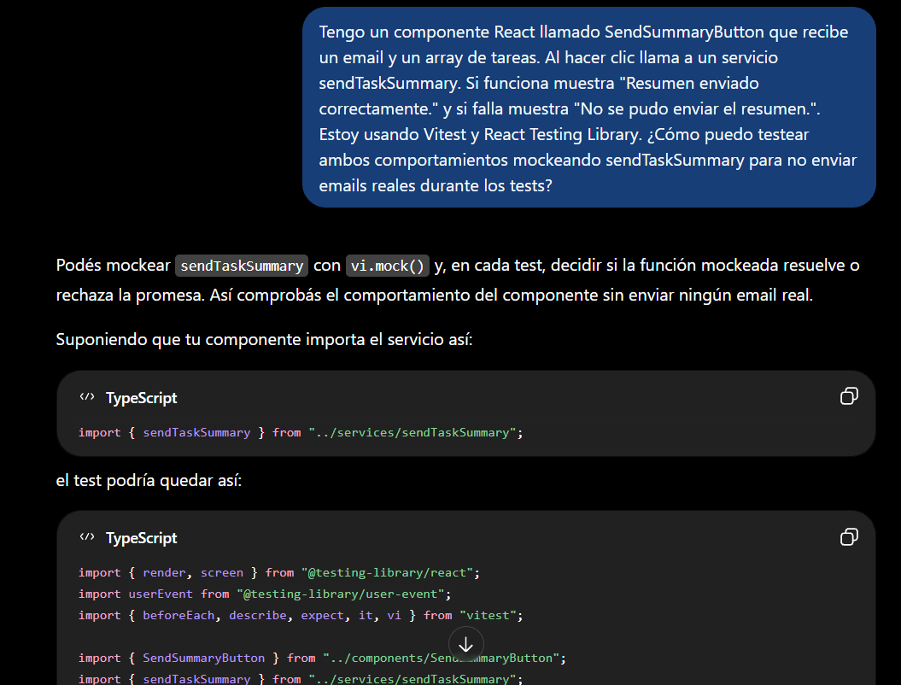
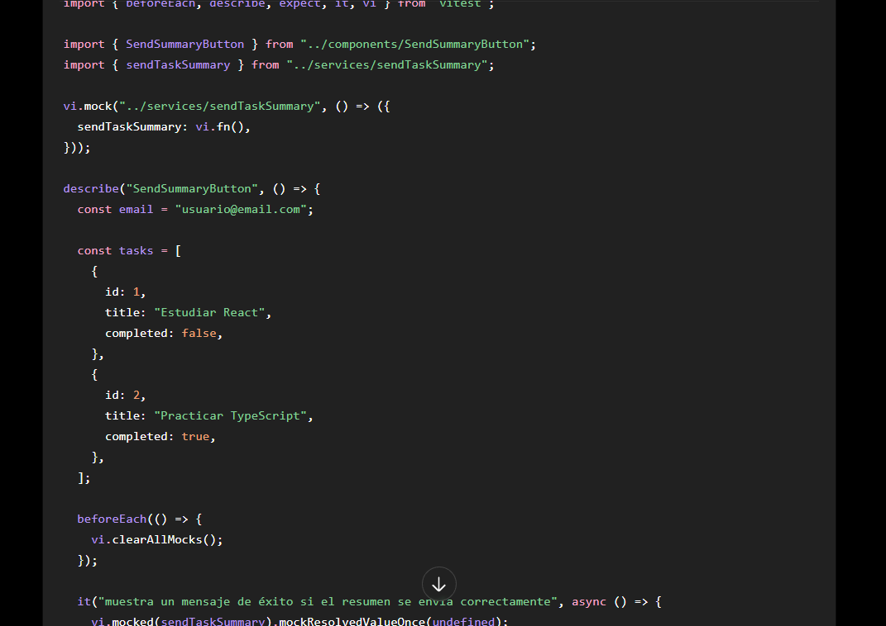
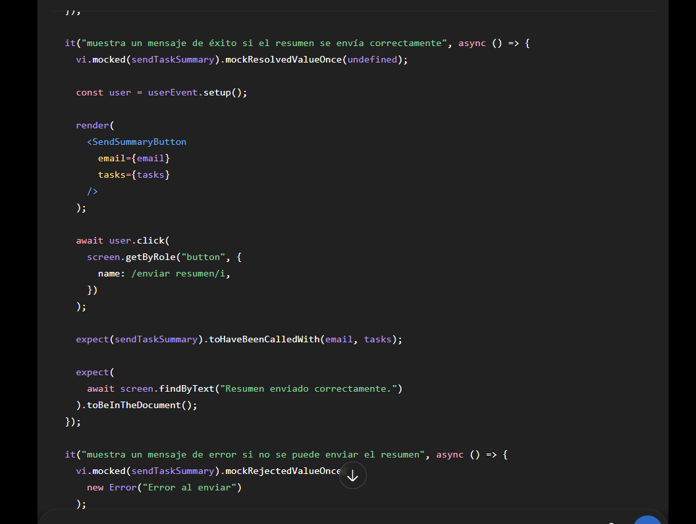
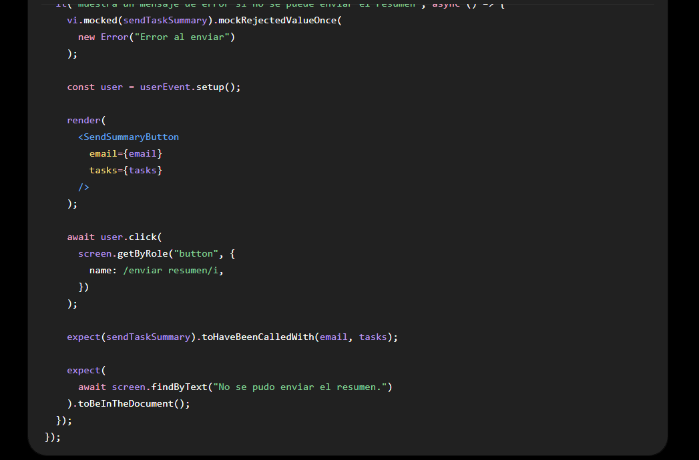

# Gestor de Tareas

Aplicación web desarrollada con **React y TypeScript** para gestionar tareas personales.

Cada usuario puede registrarse, iniciar sesión y administrar únicamente sus propias tareas. La aplicación utiliza **Firebase Authentication**, **Cloud Firestore**, **Vercel Serverless Functions** y **AWS SES**.

## Deploy

Aplicación disponible en Vercel:

https://proyecto-m4-nayla-pereira.vercel.app

Las variables de entorno necesarias para Firebase y AWS SES se encuentran configuradas en Vercel para el entorno de producción.

## Funcionalidades

- Registro, inicio y cierre de sesión.
- Rutas protegidas y persistencia de sesión.
- Creación, edición y eliminación de tareas.
- Tareas pendientes y completadas.
- Priorización y filtrado de tareas.
- Actualización en tiempo real con Firestore.
- Separación de tareas por usuario.
- Envío de un resumen de tareas por email mediante AWS SES.
- Manejo de estados de carga y errores.
- Modo claro y oscuro.
- Diseño responsive.

## Tecnologías

- React + TypeScript
- Vite
- React Router DOM
- Firebase Authentication
- Cloud Firestore
- Vercel Serverless Functions
- AWS SES
- Vitest
- React Testing Library
- ESLint

## Arquitectura

El proyecto separa componentes, lógica, acceso a datos y servicios externos:

```text
gestor-tareas/
├── api/                 # Funciones serverless y AWS SES
├── docs/images/         # Capturas para documentación
├── src/
│   ├── components/      # Componentes de interfaz
│   ├── features/        # Lógica de funcionalidades
│   ├── hooks/           # Hooks personalizados
│   ├── pages/           # Páginas
│   ├── services/        # Firebase, tareas y email
│   ├── styles/          # Estilos
│   ├── tests/           # Tests
│   └── types/           # Tipos de TypeScript
├── .env.example
└── package.json
```

## Firebase

**Firebase Authentication** se utiliza para registro, login, logout y persistencia de sesión.

Las tareas se almacenan en **Cloud Firestore** y se consultan según el usuario autenticado. Se utilizan suscripciones en tiempo real para reflejar los cambios sin recargar la página.

Las reglas de seguridad de Firestore restringen la creación, lectura, modificación y eliminación de tareas según el `userId` del usuario autenticado.

Se comprobó utilizando dos cuentas diferentes que cada usuario visualiza únicamente sus propias tareas.

## AWS SES

El resumen de tareas se envía mediante **AWS SES**.

Las credenciales de AWS no se exponen en el frontend. El navegador realiza una petición a una **Vercel Serverless Function**, que valida los datos recibidos y realiza el envío mediante SES.

```text
Frontend → Vercel Serverless Function → AWS SES → Email
```



## Variables de entorno

Crear un archivo `.env` tomando como referencia `.env.example`:

```env
VITE_FIREBASE_API_KEY=
VITE_FIREBASE_AUTH_DOMAIN=
VITE_FIREBASE_PROJECT_ID=
VITE_FIREBASE_STORAGE_BUCKET=
VITE_FIREBASE_MESSAGING_SENDER_ID=
VITE_FIREBASE_APP_ID=

AWS_REGION=us-east-2
AWS_ACCESS_KEY_ID=
AWS_SECRET_ACCESS_KEY=
SES_FROM_EMAIL=
```

Las credenciales reales no deben subirse al repositorio.

## Instalación

```bash
git clone https://github.com/naylapereira/ProyectoM4_NaylaPereira-.git gestor-tareas
cd gestor-tareas
npm install
```

Completar las variables de entorno y ejecutar:

```bash
npm run dev
```

Para probar también las funciones serverless localmente:

```bash
npx vercel dev
```

## Testing

Los tests utilizan **Vitest y React Testing Library**.

```bash
npm run test
```

La suite cuenta con **11 tests en 5 archivos** e incluye:

- filtrado e interacción con tareas;
- caso borde de tarea vacía;
- mocks del servicio de email;
- envío exitoso y fallido;
- validación del payload del serverless;
- manejo de errores del serverless.



También se puede verificar el proyecto con:

```bash
npm run lint
npm run build
```

## Capturas





## Uso de inteligencia artificial

Se utilizó inteligencia artificial como herramienta de apoyo durante el desarrollo para analizar errores, revisar implementaciones, organizar la arquitectura y diseñar casos de prueba.

Las sugerencias no se incorporaron automáticamente: se adaptaron a la estructura existente y se comprobaron mediante pruebas manuales, tests, ESLint, build y ejecución en producción.

Entre los usos principales estuvieron:

- resolución de problemas durante la integración con AWS SES;
- revisión de componentes, hooks y servicios;
- diseño de tests y mocks;
- revisión de validaciones y manejo de errores;
- mejoras de interfaz y documentación.

También se modificaron o descartaron propuestas cuando no se adaptaban a la implementación existente.

### Ejemplos del uso de la Inteligencia Artificial con capturas

#### Ejemplo 1





En este ejemplo se utilizó IA para consultar una forma simple de implementar el filtrado de tareas con TypeScript. La propuesta se comparó con la estructura del proyecto y se adaptó utilizando los tipos y el modelo `Task` existentes.

#### Ejemplo 2









En este ejemplo se utilizó IA como apoyo para diseñar pruebas del componente `SendSummaryButton`. La respuesta sirvió como referencia para mockear el servicio `sendTaskSummary` y comprobar los casos de éxito y error sin realizar envíos reales durante los tests. El código propuesto se adaptó a los componentes, tipos y estructura existentes del proyecto.

## Estado de verificación

Se comprobó el funcionamiento de autenticación, aislamiento de tareas entre usuarios, CRUD, actualización en tiempo real, filtros, prioridades, envío de email y rutas protegidas.

Además:

- **11/11 tests pasan**
- **ESLint sin errores**
- **Build exitoso**
- **Deploy funcional en Vercel**